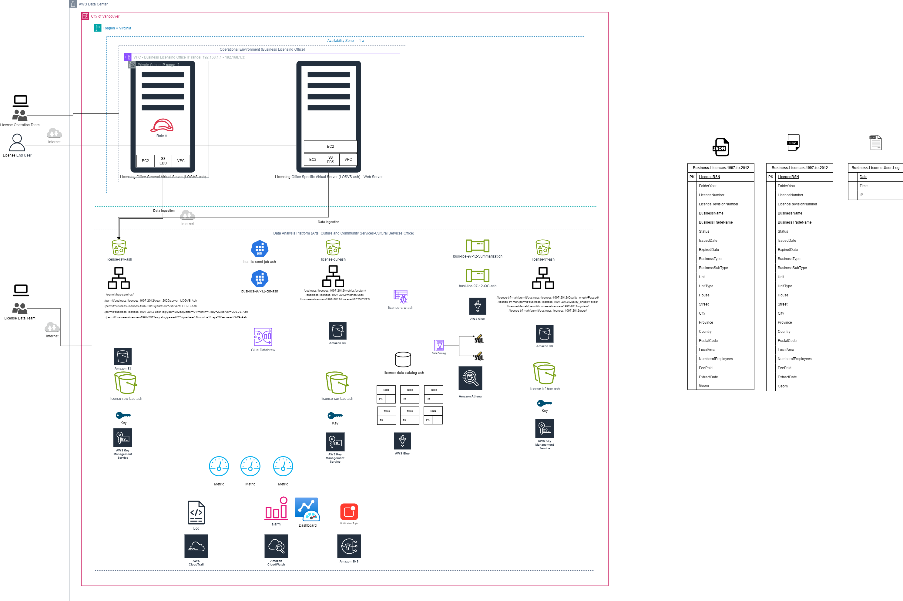
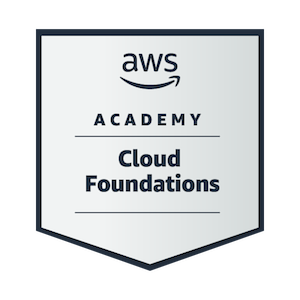

# AWS-Portfolio

# Business Licensing Data Analytics on AWS

This project is part of my MBA coursework in **Cloud Computing** and demonstrates my ability to use Amazon Web Services (AWS) to perform a full **Descriptive Analysis** on business licensing data from the **City of Vancouver**.

This is my **first cloud project** and my **first GitHub portfolio**, and it showcases my journey as I begin building practical cloud solutions using AWS.

---

## Project Objective

To analyze business licensing data for the City of Vancouver (1997–2012) using AWS cloud services and uncover patterns in license issuance and fee collection. The analysis includes multiple phases: data ingestion, profiling, cleaning, cataloging & summarization, analysis, and governance & monitoring.

---

## Dataset Information: Business Licences 1997–2012

The dataset includes business licence records from **1997 to 2012**, collected by the **City of Vancouver** under Licence By-Law No. 4450. It captures details about licensing, business types, and locations within the city. The dataset is available in both **CSV** and **JSON** formats and includes the following key features:

- **LicenceRSN:** A unique identifier for each business licence issued  
- **LicenceNumber:** Encoded with year and system-generated number (e.g., `97-144521`)  
- **BusinessName:** Official name or ownership of the business  
- **BusinessTradeName:** Name under which the business typically operates  
- **Status:** Indicates licence state (e.g., *Issued*, *Cancelled*, *Gone Out of Business*)  
- **IssuedDate / ExpiredDate:** Start and end dates of the licence validity  
- **BusinessType:** Type of business activity (e.g., *Health Services*, *Retail Dealer*)  
- **BusinessSubType:** Further classification under the main type (e.g., *Tanning Salon*)  
- **Street Address Fields:** Includes `Unit`, `House`, `Street`, `City`, `Province`, `Country`, and `PostalCode`  
- **LocalArea:** Planning zone within Vancouver (e.g., *Fairview*, *Downtown*)  
- **NumberofEmployees:** Reported number of employees
- **FeePaid:** Licensing fee paid in Canadian dollars  
- **ExtractDate:** When the data was exported from the City's database  

This dataset is used throughout the project for ingestion, profiling, cleaning, and summarization tasks in AWS.

- **Source:** [City of Vancouver Open Data Portal](https://opendata.vancouver.ca/)
- **Dataset Name:** `business-licences-1997-to-2012`
- **Formats Used:** CSV and JSON
- **Folder:** [`datasets/`](./datasets/)

---

## Methodology: AWS-Based Descriptive Analytics Workflow (6 Phases)

The following methodology adapts our professor’s recommended business analytics pipeline into a fully cloud-native AWS architecture. Each phase contributed toward producing a clean, optimized, and analysis-ready dataset, while incorporating governance, monitoring, and validation features.

### Phase 1: Data Ingestion  
- Used Amazon EC2 to upload CSV and JSON data files to S3 (`licence-raw-ash`)
- Enabled encryption using AWS KMS, set versioning, and configured cross-region replication for resilience

### Phase 2: Data Profiling  
- Profiled raw data using AWS Glue DataBrew
- Evaluated column stats, missing values, outliers, and nested JSON attributes to understand initial data quality

### Phase 3: Data Cleaning  
- Designed and applied transformation recipes in Glue DataBrew
- Cleaned and reformatted records, filtered key columns, and converted to CSV/Parquet for structured output
- Outputs were stored in separate folders (`user/` and `system/`) under the transfer bucket (`licence-trf-ash`)

### Phase 4: Data Cataloging & Summarization  
- Created Glue Crawlers to register cleaned data as schema-aware tables in Glue Data Catalog
- Built a Glue ETL pipeline to apply schema transformations and aggregate metrics by month
- Registered the summarized output to the curated bucket (`licence-cur-ash`) and made it queryable via Amazon Athena

### Phase 5: Data Analysis  
- Queried summarized Parquet tables using Amazon Athena to extract trends
- Validated license issuance trends and total fees across time (1997–2012)
- Compared AWS query output with the official City of Vancouver data portal for accuracy

### Phase 6: Data Governance & Monitoring  
- Built a data quality pipeline in AWS Glue to route records into `Passed` and `Failed` folders based on validation logic
- Monitored system usage via Amazon CloudWatch with custom dashboards
- Set up AWS CloudTrail for full auditing and traceability of ETL activity

---

## Project Architecture Diagram

This architecture showcases how the dataset moves from ingestion to summarization across AWS services, with encryption, versioning, and monitoring enabled for governance.

---
## Project Workflow

The project is organized into **six key phases**, each stored in its own folder with screenshots and detailed explanations.

| Phase | Folder | Description |
|-------|--------|-------------|
| **Phase 1** | [`phase-1-ingestion/`](./phase-1-ingestion) | Uploading dataset to S3, enabling encryption, versioning, and replication |
| **Phase 2** | [`phase-2-profiling/`](./phase-2-profiling) | Profiling the raw data using AWS Glue DataBrew |
| **Phase 3** | [`phase-3-cleaning/`](./phase-3-cleaning) | Cleaning and transforming using DataBrew recipes |
| **Phase 4** | [`phase-4-cataloging-summarization/`](./phase-4-cataloging-summarization) | Cataloging metadata and summarizing datasets using Glue Crawlers, Glue Studio, and Athena |
| **Phase 5** | [`phase-5-data-analysis/`](./phase-5-data-analysis) | Performing SQL-based data analysis and external validation using Vancouver’s open data portal |
| **Phase 6** | [`phase-6-data-governance-&-Monitoring/`](./phase-6-data-governance-&-Monitoring) | Implementing data governance, quality checks, and system monitoring with Glue, CloudWatch, and CloudTrail |

---

### Insights and Learnings

The descriptive analysis conducted on the business licensing dataset from the City of Vancouver (1997–2012) provided critical insights into license issuance patterns, revenue collection, data quality, and infrastructure monitoring.

Using AWS Glue DataBrew and Amazon Athena, we discovered that license issuance and fee collections peaked between **2004–2008**, with the highest revenue recorded in **2007 (~$24,146 CAD)**. A gradual decline followed post-2009, with **2012 marking the lowest activity**, suggesting economic or regulatory shifts during that time. Analysis also revealed that **most years issued between 30–40 licenses**, indicating relatively steady activity.

The most frequent business types included:
- **Live-aboards** (128 records)
- **One-Family Dwelling** (58)
- **Office** (39)
- **Duplex** (34)
- **Multiple Dwelling** (28)

These findings point to a strong representation of **home-based or residential licenses** prior to the 2018 privacy-related data suppression.

Profiling further revealed discrepancies like `NumberofEmployees` often being `0` or `000`, showing poor input validation. Additionally, multiple nested and incomplete fields in the raw JSON format were successfully flattened and transformed using DataBrew into **Parquet format**, optimizing performance for SQL-based analytics.

On the data quality front, AWS Glue’s **Data Quality Transformations** were employed to separate and route datasets based on pass/fail thresholds—enabling proactive governance and ensuring that only high-quality data flows into downstream analytics.

Real-time monitoring was enabled through:
- **AWS CloudWatch Dashboards** – tracking bucket sizes and resource usage.
- **AWS CloudTrail** – logging all activity across the AWS environment for audit and compliance.

By aligning our data schema and reporting logic with Vancouver’s official open data portal, we also validated that our insights mirrored authentic municipal reporting patterns. This closed-loop verification added credibility to our pipeline's analytical output.

---

### Recommendations

Based on this comprehensive cloud-native analytics pipeline, the following recommendations are proposed:

1. **Enforce Structured Input Validation**  
   Fields like `NumberofEmployees` and `BusinessType` should implement dropdowns or regex validations at the data collection source to eliminate zeros, blanks, and invalid entries.

2. **Implement Real-Time Governance Triggers**  
   Automate data quality workflows using **AWS Glue Job Bookmarks** or **Step Functions** to routinely filter, route, and monitor records in real-time rather than via batch jobs.

3. **Enhance Business Classification Taxonomy**  
   Some business categories appear outdated or inconsistent (e.g., *Live-aboards*, *One-Family Dwelling*). Introduce a modern classification system using NAICS or a custom city taxonomy for better segmentation.

4. **Expand Monitoring Coverage**  
   Enhance the existing CloudWatch dashboard to include **Athena query performance metrics**, **ETL run health**, and **storage cost alerts**, helping reduce delays and costs.

5. **Establish Version-Controlled Data Lake**  
   Leverage **Lake Formation** and **versioned S3 buckets** for maintaining historical snapshots of datasets—ensuring rollback and reproducibility of analytical experiments.

6. **Maintain Alignment with Public Open Data Standards**  
   Ensure any future transformations or aggregations remain consistent with city-published open datasets to enhance transparency, public trust, and external validation opportunities.

---

## AWS Services Used

| Service                  | Purpose                                                                                      |
|--------------------------|----------------------------------------------------------------------------------------------|
| **Amazon EC2**           | Upload and prepare dataset files for ingestion into S3                                       |
| **Amazon S3**            | Store raw, cleaned, transformed, and validated datasets across buckets and folders           |
| **AWS KMS**              | Enable encryption for secure storage and data privacy                                        |
| **AWS Glue DataBrew**    | Perform profiling, cleaning, flattening of nested fields, and transformation into Parquet    |
| **AWS Glue Crawler**     | Auto-detect schema and register datasets into AWS Glue Data Catalog                          |
| **AWS Glue Studio**      | Build and visualize ETL pipelines for schema standardization and transformation              |
| **AWS Glue ETL Workflows** | Conduct data quality checks, conditional routing to `Passed` or `Failed` folders            |
| **Amazon Athena**        | Perform SQL-based analysis and aggregation on structured data                                |
| **AWS CloudWatch**       | Monitor system metrics including bucket usage and job performance via custom dashboards      |
| **AWS CloudTrail**       | Enable full activity logging for auditing, compliance, and transparency                      |
| **Vancouver Open Data Portal** | Used as a benchmark for external validation of insights and reporting patterns         |

---

##  Interactive Visualization (City of Vancouver Portal)

The chart below shows licensing fee trends over time based on the dataset used in this project.

[View Interactive Chart on City of Vancouver Portal](https://opendata.vancouver.ca/explore/dataset/business-licences-1997-to-2012/analyze/?disjunctive.businesssubtype&disjunctive.status&refine.city=VANCOUVER&dataChart=eyJxdWVyaWVzIjpbeyJjaGFydHMiOlt7ImFsaWduTW9udGgiOnRydWUsInR5cGUiOiJsaW5lIiwiZnVuYyI6IkNPVU5UIiwieUF4aXMiOiJmZWVwYWlkIiwic2NpZW50aWZpY0Rpc3BsYXkiOnRydWUsImNvbG9yIjoiIzYxYTY0NCJ9LHsidHlwZSI6ImxpbmUiLCJmdW5jIjoiU1VNIiwieUF4aXMiOiJmZWVwYWlkIiwic2NpZW50aWZpY0Rpc3BsYXkiOnRydWUsImNvbG9yIjoiIzAyNzlCMSJ9XSwieEF4aXMiOiJpc3N1ZWRkYXRlIiwibWF4cG9pbnRzIjpudWxsLCJ0aW1lc2NhbGUiOiJtb250aCIsInNvcnQiOiIiLCJzZXJpZXNCcmVha2Rvd25UaW1lc2NhbGUiOiIiLCJjb25maWciOnsiZGF0YXNldCI6ImJ1c2luZXNzLWxpY2VuY2VzLTE5OTctdG8tMjAxMiIsIm9wdGlvbnMiOnsiZGlzanVuY3RpdmUuYnVzaW5lc3NzdWJ0eXBlIjp0cnVlLCJkaXNqdW5jdGl2ZS5zdGF0dXMiOnRydWUsInJlZmluZS5jaXR5IjoiVkFOQ09VVkVSIn19fV0sImRpc3BsYXlMZWdlbmQiOnRydWUsImFsaWduTW9udGgiOnRydWUsInRpbWVzY2FsZSI6IiJ9)

---

## Certification

I have earned the **AWS Cloud Practitioner (Foundations)** certification, which demonstrates my understanding of AWS Cloud concepts, services, and basic architectural best practices.

Certification: [View Certification PDF](certification/AWS-Cloud-Foundations-certificate-Ashwani.pdf)

---

## GitHub Pages Portfolio

Visit live project: [GitHub Pages](https://buildwithashwani.github.io/AWS-Portfolio)

---

## Key Learnings & Outcome

- Gained hands-on experience with the **AWS Analytics ecosystem**
- Successfully processed and transformed real-world open data
- Improved understanding of data profiling, governance, and security
- Designed scalable cloud-based data analytics workflows

---

## About Me

I'm **Ashwani**, an MBA student with a background in architecture and a growing passion for cloud computing and analytics.  
This project marks the start of my journey in building real-world AWS solutions.

---

