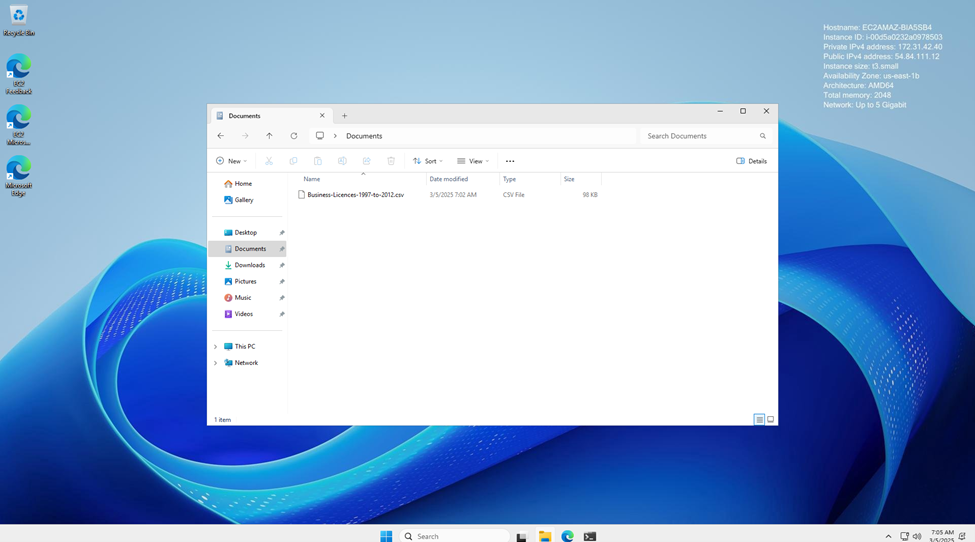
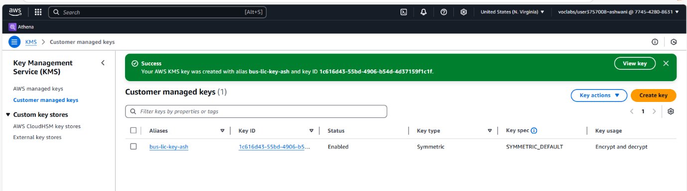
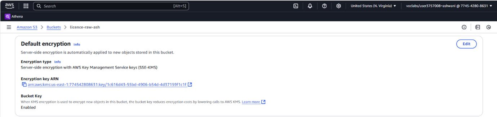
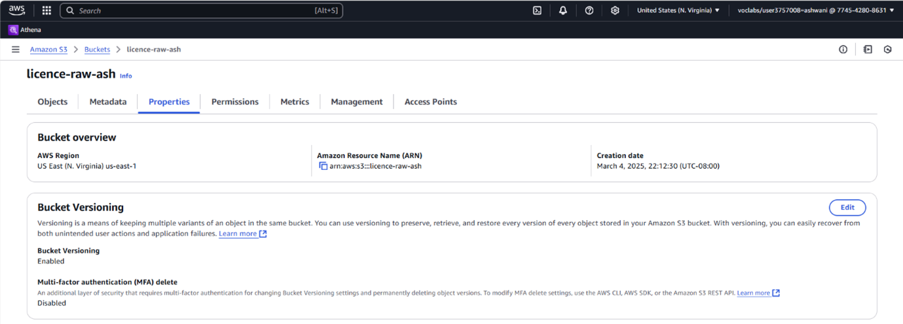
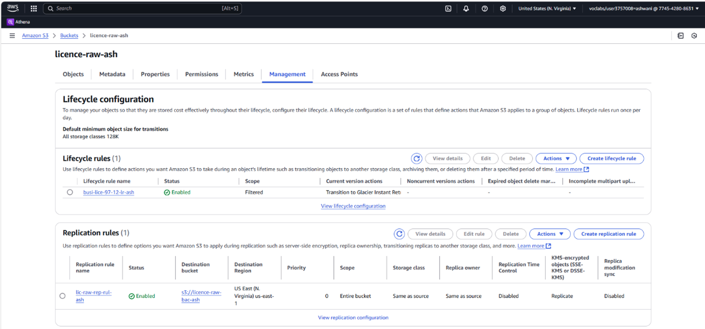

# Phase 1 – Data Ingestion

## Objective

The goal of this phase was to ingest raw data into Amazon S3 in a secure and structured manner that aligns with real-world cloud data lake standards. This phase marks the foundation of the entire analytics pipeline, ensuring that every subsequent AWS service operates on a reliable, encrypted, and version-controlled dataset.

---

## Overview of Activities

This phase was performed on the AWS platform using a combination of compute and storage services:

- Data was staged using **Amazon EC2** and pushed to cloud storage using **Amazon S3**
- Security and compliance controls were enforced using **AWS KMS encryption**, **S3 versioning**, and **cross-bucket replication**
- Raw data was stored in its original format (`CSV` and `JSON`) to preserve schema flexibility for downstream services like DataBrew, Glue Studio, and Athena

---

## Services & Features Used

| AWS Component       | Purpose |
|---------------------|---------|
| **Amazon EC2**      | Used as a virtual environment to simulate local machine uploads |
| **Amazon S3**       | Cloud-based data lake storage (raw zone) for original datasets |
| **AWS KMS**         | Created and applied encryption key to secure all data at rest |
| **S3 Versioning**   | Enabled to preserve all versions of the uploaded datasets |
| **S3 Replication**  | Configured to mirror data from the raw bucket for redundancy and high availability |

---

## Steps Performed

### 1. Preparing the Dataset
The two source files used were:
- `Business-Licences-1997-to-2012.csv` (primary format used for ingestion and profiling)
- `business-licences-1997-to-2012.json` (used later for semi-structured testing in Glue Studio)

These were stored on an Amazon EC2 instance acting as a staging server.

---

### 2. Creating the Raw Data S3 Bucket
A new S3 bucket was created with a naming convention appropriate for raw storage zones in a data lake (e.g., `s3://licence-raw-ash/permit/bBusiness-licences-1997-2012/`).

This bucket was configured to:
- Accept uploads only via secure access
- Serve as the "raw zone" for the data pipeline

---

### 3. Applying Encryption Using AWS KMS
A **customer-managed key** was created using **AWS Key Management Service (KMS)**.  
This key was applied to enforce **SSE-KMS** encryption on all incoming objects in the raw bucket.

  

---

### 4. Enabling S3 Versioning
Versioning was turned on for the bucket to allow rollback or recovery of previous file versions. This aligns with industry data governance practices and protects against accidental overwrites or deletions.

---

### 5. Configuring Cross-Bucket Replication
To improve fault tolerance and data durability, a **cross-bucket replication** policy was created to mirror all objects from the raw data bucket into a second S3 bucket located in a different region. This configuration enhances disaster recovery readiness and reflects enterprise-grade data lake architecture.

---

## Outcome

This phase resulted in a secure, scalable, and policy-compliant data landing zone using S3. Encryption and versioning ensure the integrity of uploaded data, while replication supports geographic redundancy. The ingestion step prepared the way for profiling, cleaning, and summarizing downstream, while maintaining traceability and control of data lineage.

---

## Folder Path Reference

This folder serves as the entry point to the AWS analytics pipeline.

`s3://licence-raw-ash/permit/business-licences-1997-2012/`

---

## Summary

The ingestion phase successfully bridged the gap between local/raw data and cloud-native analytics by deploying AWS foundational services with best practices. It reflects secure storage principles, compliance-readiness, and modularity essential for building advanced data workflows.

