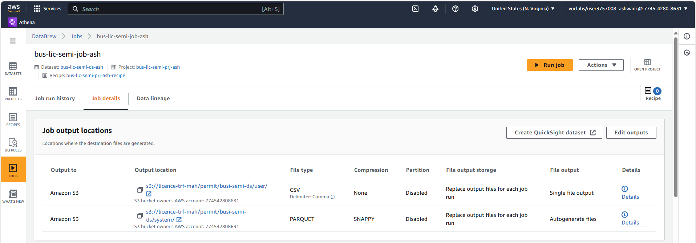
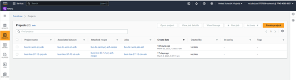
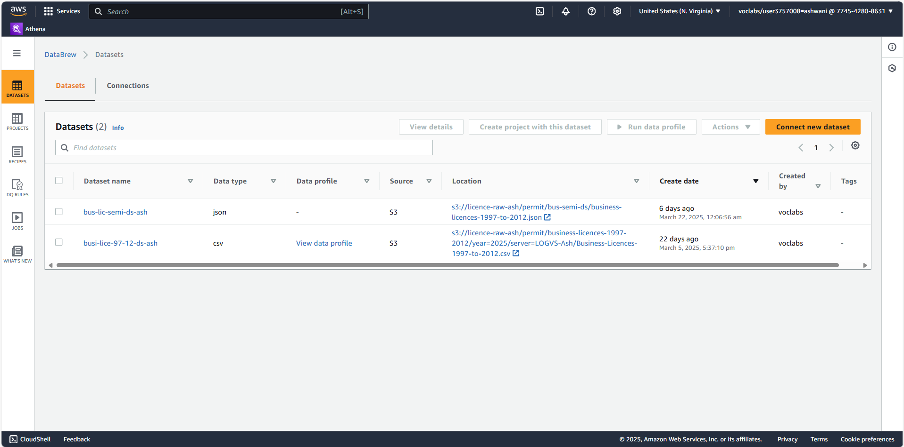
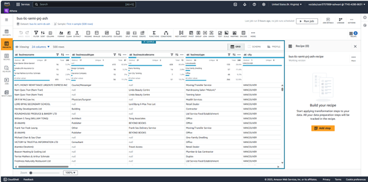
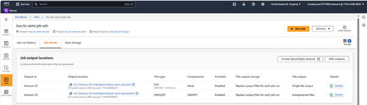
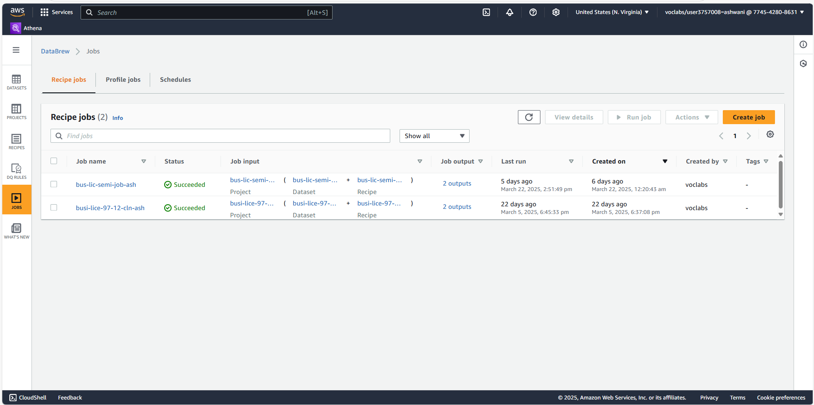
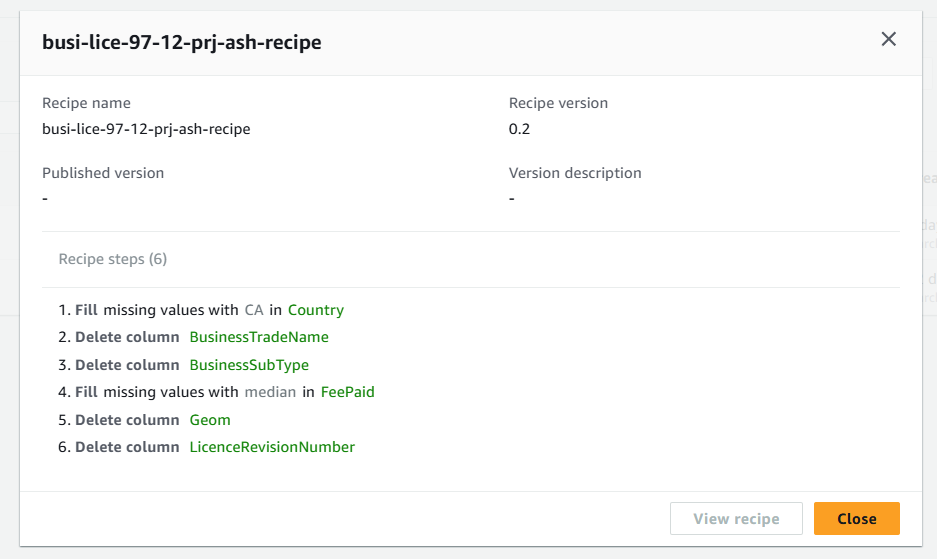

# Phase 2 – Data Profiling

## Objective

The primary objective of this phase was to perform data profiling on the raw dataset using AWS Glue DataBrew. Profiling helped in understanding data quality, structure, and completeness — enabling better planning for cleaning and transformation in the next phase.

Both the CSV and JSON versions of the dataset (`business-licences-1997-to-2012`) were uploaded into AWS S3 during Phase 1 and were used in this step to explore schema consistency and completeness.

---

## Services & Tools Used

| AWS Component         | Purpose                                                                 |
|-----------------------|-------------------------------------------------------------------------|
| **AWS Glue DataBrew** | Visual data profiling and quality assessment                           |
| **Amazon S3**         | Served as data source for profiling                                     |
| **Glue Recipes**      | Defined transformations and flagged issues (nulls, structure, etc.)     |

---

## Steps Performed

### 1. Dataset Registration

Two datasets were registered in AWS Glue DataBrew from the S3 buckets:
- `busi-lice-97-12-ds-ash` (CSV)
- `bus-lic-semi-ds-ash` (JSON)

---

### 2. Creating Projects

Separate projects were created for each dataset:
- For CSV: `busi-lice-97-12-prj-ash`
- For JSON: `bus-lic-semi-prj-ash`

These projects allowed full visibility into column types, distinct values, null percentages, and schema structure.

  
  

---

### 3. Running Profiling Jobs

Data profiles were run from within each project to summarize:
- Null values
- Data types
- Outliers
- Cardinality of columns
- Most common values

This resulted in highly visual summaries to help guide downstream cleaning.

---

### 4. Analyzing Job Outputs

The profiling jobs generated results in both CSV and Parquet formats. Outputs were stored securely in S3 under transfer/curate zones.

  

---

### 5. Reviewing Recipe Steps

The transformation recipe was not only visual but tracked all cleaning steps to be executed in the next phase. Missing values, unnecessary columns, and inconsistent formatting were identified.

---

## Key Findings

- Several columns contained a high percentage of nulls (e.g., `BusinessTradeName`, `Geom`)
- `FeePaid` had missing numeric values needing imputation
- Certain categorical fields (e.g., `BusinessType`, `BusinessSubType`) included historical or obsolete values
- `Country` field was missing in many rows but consistently “CA” (Canada) for known records

---

## Outcome

This phase provided a clear statistical and structural summary of the dataset, laying the foundation for automated cleaning via recipe steps in Phase 3. Profiling helped quantify data issues and define targeted transformations.

---

## Screenshot Summary

| Screenshot                        | Description                                |
|----------------------------------|--------------------------------------------|
| `databrew-datasets-list.png`     | Dataset registration screen                |
| `databrew-project-creation.png`  | Project created for CSV                    |
| `databrew-project-intefface.png` | Interface view of the DataBrew project     |
| `bus-lic-semi-prj-ash.png`       | Grid view of semi-structured (JSON) project|
| `databrew-profile-preview.png`   | Statistical summary of the dataset         |
| `databrew-job-output.png`        | Output format (CSV and Parquet)            |
| `databrew-job-success.png`       | Successful profiling job runs              |
| `databrew-recipe-steps-main-ds.png` | Recipe steps to address data issues     |

---

## Path Reference

s3://licence-trf-ash/permit/business-licences-1997-2012/

This was the source path for profiling datasets in this phase.
