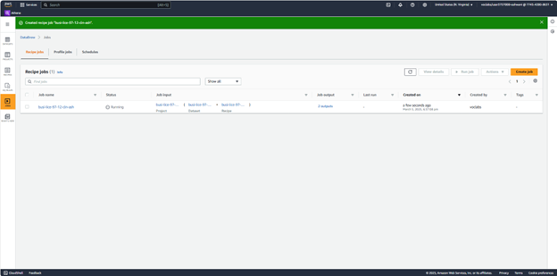
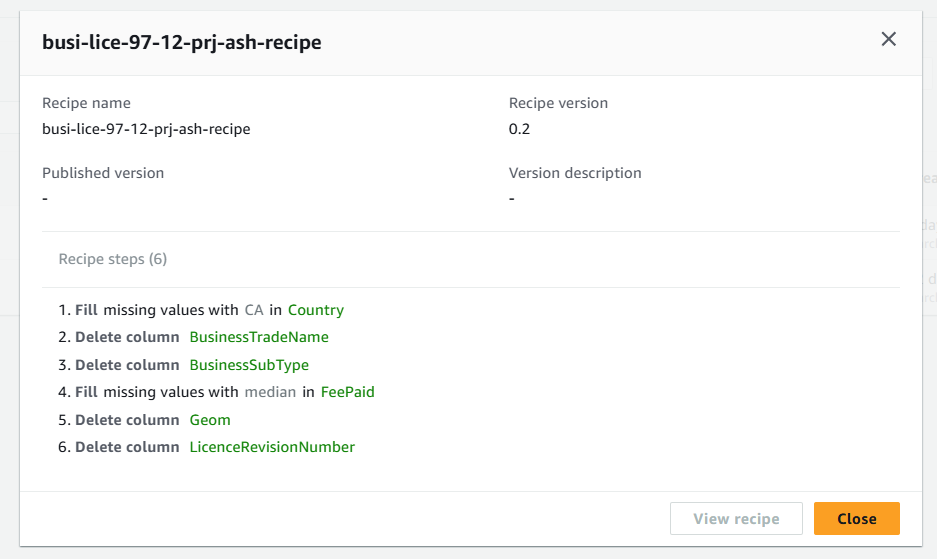
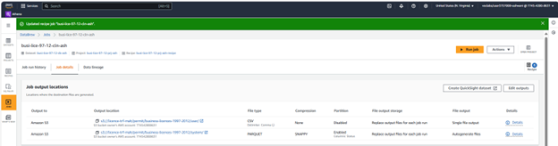
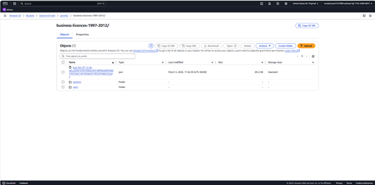
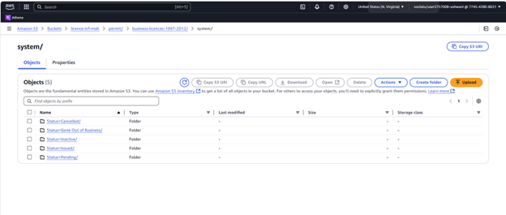
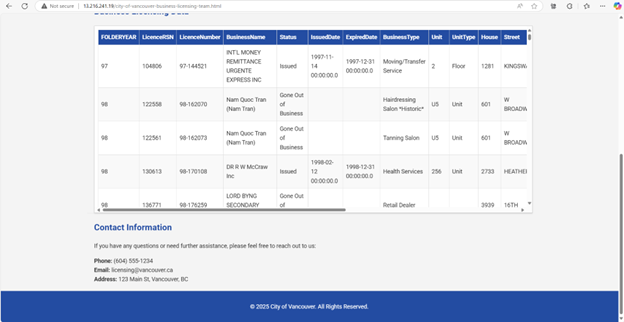
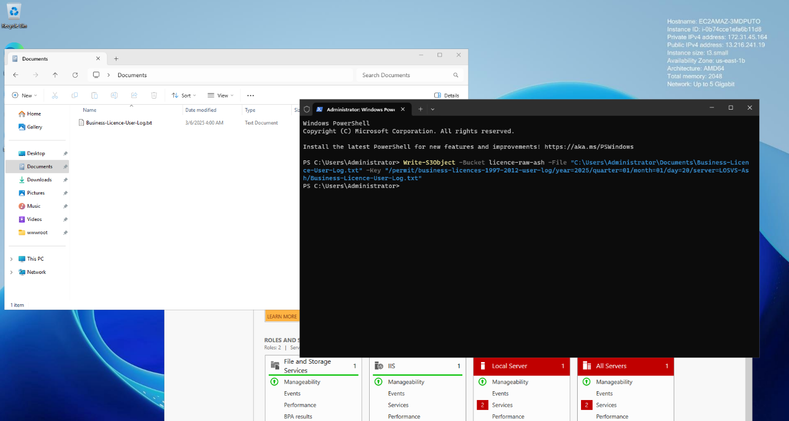
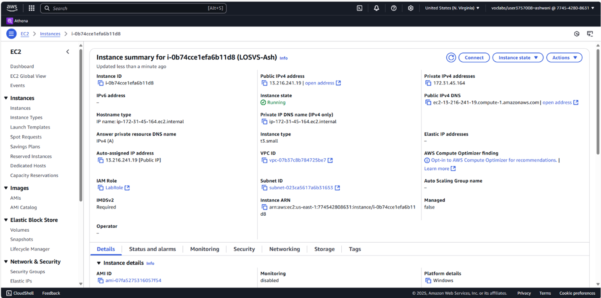

# Phase 3: Data Cleaning

## Objective

In this phase, we focused on preparing the raw business licensing data for analytics by addressing inconsistencies, missing values, and irrelevant fields. Using AWS Glue DataBrew, we created a cleaning pipeline that outputs data in multiple formats (CSV and Parquet) and hosted the results using an EC2 instance. This simulates a real-world publishing environment for structured datasets.

---

## Tools & Services Used

- **AWS S3**: Source and destination for input/output data
- **AWS Glue DataBrew**: Data cleaning and transformation
- **AWS EC2 (Windows)**: For hosting cleaned data via IIS
- **PowerShell**: For log upload to S3

---

## Workflow Overview

### Data Cleaning with AWS Glue DataBrew

A cleaning job named `busi-lice-97-12-cln-ash` was created using a custom recipe. This recipe focused on transforming and refining the dataset by:

- Filling missing values in the `Country` and `FeePaid` columns
- Removing unnecessary columns such as `BusinessTradeName`, `BusinessSubType`, `Geom`, and `LicenceRevisionNumber`

| Screenshot | Description |
|------------|-------------|
|  | View of Glue DataBrew job listing before execution |
|  | Custom recipe steps created for cleaning |
|  | Output configuration for CSV and Parquet formats |

---

### Cleaned Data Storage in S3 (Transfer Bucket)

The cleaned data was saved in the **transfer bucket** (`licence-trf-ash`) in two logical folders:
- `/user/` for CSV
- `/system/` for Parquet (partitioned by `Status`)

| Screenshot | Description |
|------------|-------------|
|  | Cleaned JSON output file |
|  | Cleaned CSV file inside `user/` folder |
|  | Partitioned Parquet folders based on `Status` |

---

### 🖥Hosting Cleaned Data on EC2 via IIS

We used a Windows-based EC2 instance to simulate public hosting of the cleaned dataset using Internet Information Services (IIS). The cleaned files were uploaded to the `wwwroot` directory.

| Screenshot | Description |
|------------|-------------|
|  | IIS root directory on EC2 Windows Server |
|  | First half of the hosted HTML table |
|  | Continuation of the hosted webpage display |

---

### Log Upload to S3 via PowerShell

To simulate audit capabilities, a user log file was manually created on the EC2 instance and uploaded to the **raw bucket** (`licence-raw-ash`) using PowerShell.

| Screenshot | Description |
|------------|-------------|
|  | Uploading log file to S3 from EC2 using PowerShell |

---

### ⚙EC2 Instance Metadata

Below is the screenshot showing EC2 instance details used in this process.

| Screenshot | Description |
|------------|-------------|
|  | Public IP, instance type, and AWS region for EC2 |

---

## Outputs & Paths

| Output Type | S3 Path |
|-------------|---------|
| Cleaned JSON | `s3://licence-trf-ash/permit/business-licences-1997-2012/` |
| Cleaned CSV | `s3://licence-trf-ash/permit/business-licences-1997-2012/user/` |
| Cleaned Parquet | `s3://licence-trf-ash/permit/business-licences-1997-2012/system/` |
| Log File | `s3://licence-raw-ash/permit/business-licences-1997-2012-user-log/` |

---

## Key Outcomes

- **Data Quality Improved**: Missing values filled using defaults (e.g., “CA” and median values)
- **Noise Reduced**: Dropped irrelevant columns
- **Efficient Storage**: Parquet format used with partitioning
- **Web-ready Output**: Hosted cleaned data on EC2
- **Traceability Added**: User activity log created and archived

---

## Next Step

In the next phase, the curated datasets will be cataloged using AWS Glue Crawlers and made queryable through AWS Athena.
