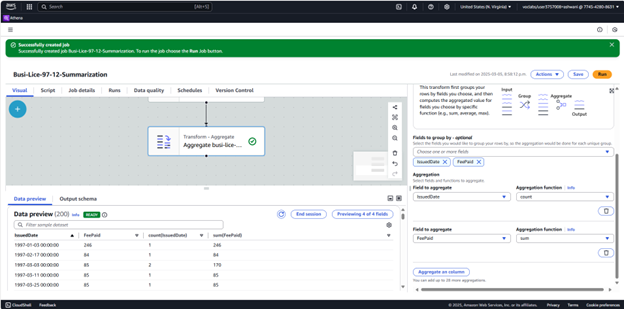
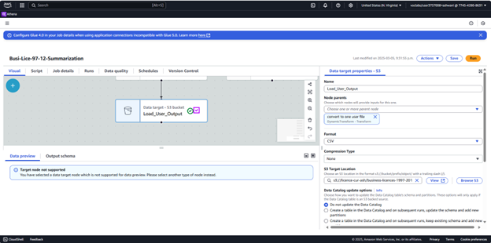
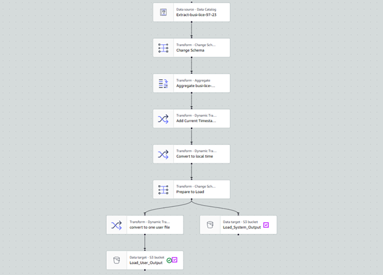
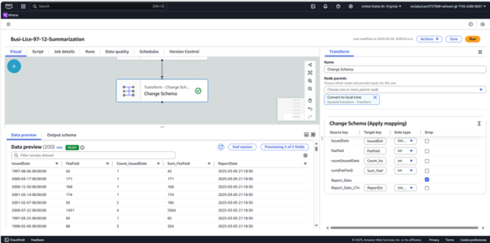
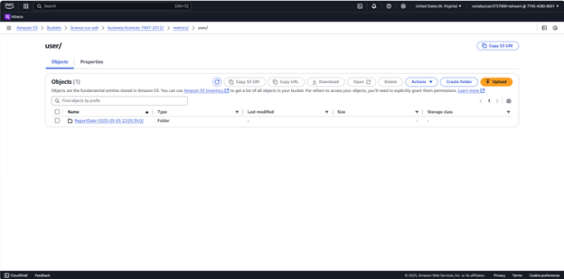
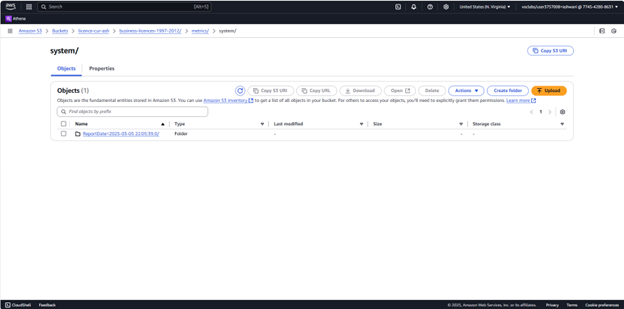
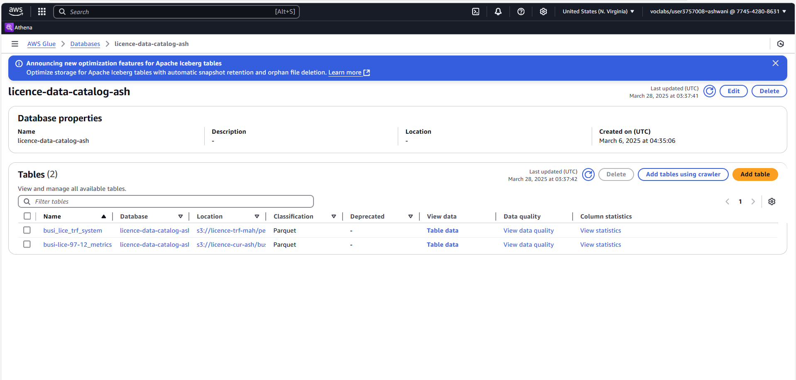
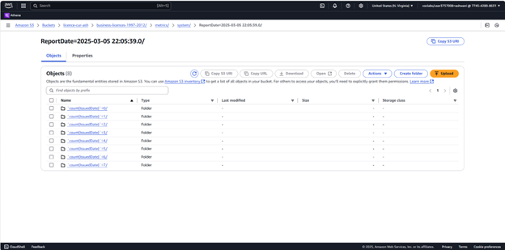
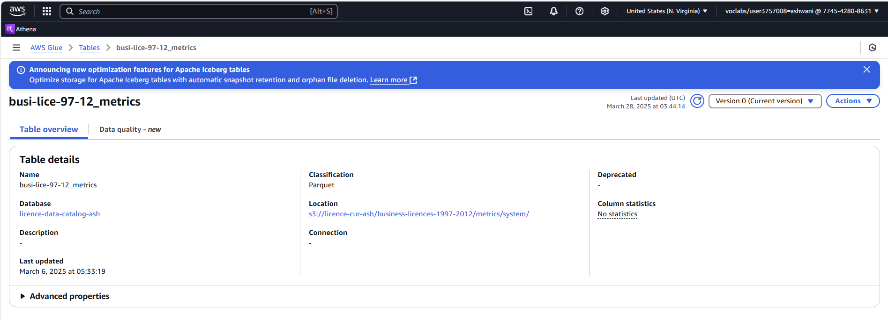

# Phase 4: Data Cataloging & Summarization

## Objective

This phase integrates two critical operations: **Data Cataloging** and **Summarization**. The objective was to first catalog the cleaned and transformed dataset stored in Parquet format using AWS Glue Crawlers and the AWS Glue Data Catalog. Once registered, we leveraged AWS Glue Studio to summarize key metrics such as license issuance counts and total fees paid. This phase enabled downstream query, reporting, and analytics capabilities.

---

## 🛠️ Tools & Services Used

- **Amazon S3**: Storage for cleaned and summarized datasets.
- **AWS Glue Crawler**: Automated schema detection and catalog registration.
- **AWS Glue Data Catalog**: Centralized metadata store for structured datasets.
- **AWS Glue Studio**: Visual interface for building the summarization job.
- **Parquet Format**: Optimized columnar format for efficient querying.

---

## Step-by-Step Process

### 1. Creating the Glue Database

We created a new Glue database titled `licence-data-catalog-ash` to store all cataloged metadata. This central repository would manage schemas for both curated and summarized datasets.

**Screenshot:**
- 

---

### 2. Configuring the Glue Crawler

To catalog our curated Parquet dataset stored at:

`s3://licence-cur-ash/business-licences-1997-2012/`


We configured a new Glue Crawler with the following settings:
- **Source**: S3 bucket with cleaned Parquet files.
- **Target**: `licence-data-catalog-ash` database.
- **Output Table**: `busi-lice-97-12_metrics`

**Screenshots:**
- 
- 
- 
- 
- 

---

### 3. Verifying the Catalog Table

The crawler generated a new Glue catalog table containing the schema for the summarized data including columns like `IssuedDate`, `FeePaid`, `count(BusinessName)`, and report timestamps.

**Screenshots:**
- 
- 
- 

---

### 4. Summarizing the Dataset via Glue Studio

We developed a Glue Studio job to create aggregated insights from the cataloged data. The process involved the following transformations:

#### Key Transformations:
- **Aggregation**: 
  - Grouped by `IssuedDate`
  - Aggregated `count(BusinessName)` and `sum(FeePaid)`
- **Schema Mapping**:
  - Renamed and cast fields for consistency.
- **Timestamps**:
  - Appended `Report_Date` and `Report_Date_Time`
- **Output Paths**:
  - CSV output to:
    ```
    s3://licence-trf-ash/business-licences-1997-2012/user/
    ```
  - Parquet output to:
    ```
    s3://licence-trf-ash/business-licences-1997-2012/system/
    ```

**Workflow Design & Screenshots:**
- 
- 
- 
- 

---

## Outcomes

- **Glue Crawler** automated schema extraction from the curated dataset.
- **Data Catalog** established for `busi-lice-97-12_metrics`, enabling quick discovery and analysis.
- **Summarized dataset** saved in optimized Parquet format with partitioning for efficient querying.
- **Output** was successfully stored in structured S3 paths under `user` and `system` folders, reflecting reporting granularity.

---

## Value Addition

By combining cataloging with summarization, we laid the foundation for scalable analytics. The Parquet output, combined with catalog metadata, enables low-cost querying through AWS Athena or other tools. These steps also ensure that the dataset is compliant with industry-standard data lake best practices.


