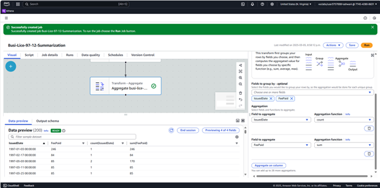
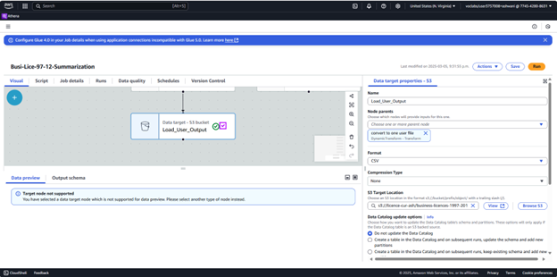
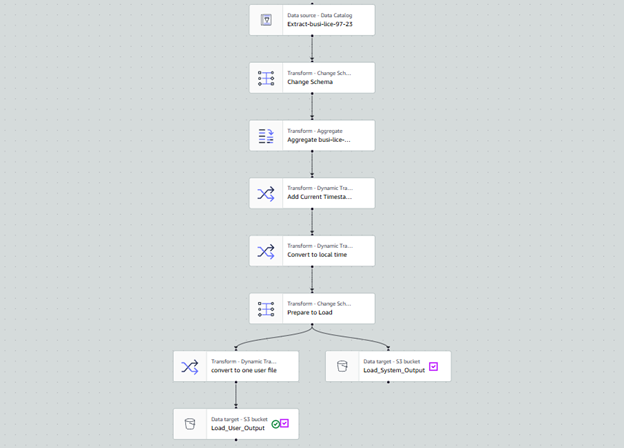
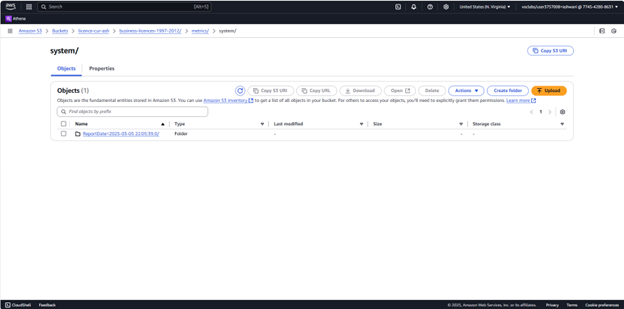
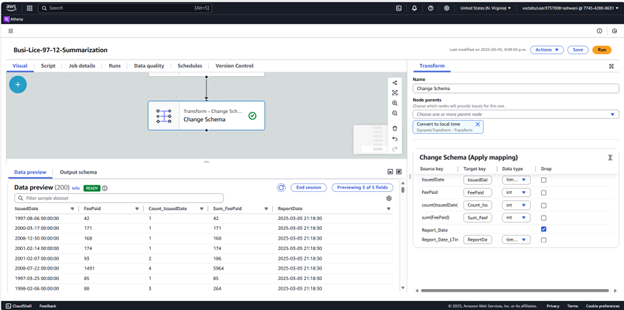
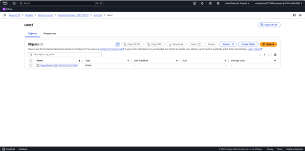
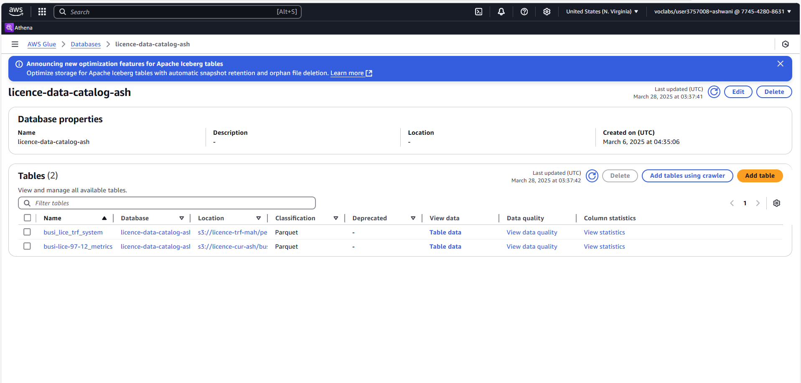
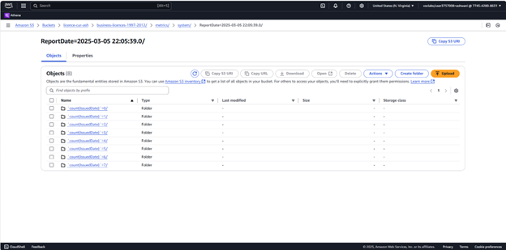
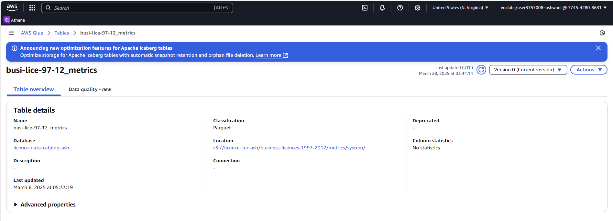

# Phase 4: Data Cataloging

## Objective
This phase focused on cataloging the cleaned and transformed datasets to enable structured querying, searchability, and metadata management using AWS Glue. The key goal was to create a centralized and searchable data catalog of the business licence records from 1997 to 2012.

---

## Tools & Services Used
- **AWS Glue Data Catalog**: To create a metadata repository of structured data.
- **AWS Glue Crawler**: To automatically detect schema and update the data catalog.
- **Amazon S3**: Source and destination buckets for curated and summarized datasets.

---

## Steps Performed

### 1. Created Glue Database

A Glue database named `licence-data-catalog-ash` was created to store metadata tables associated with both curated and summarized datasets.

---

### 2. Configured Glue Crawler

A Glue crawler was set up to scan the curated and transfer buckets. It detects the schema of the datasets and creates tables accordingly.

- **Source Configuration**: Linked to the Parquet files inside the curated bucket (`s3://licence-cur-ash/...`).
- **Target Configuration**: Set to save detected schema into `licence-data-catalog-ash`.

---

### 3. Executed Crawler

Once configured, the crawler was executed and completed successfully.

---

### 4. Tables Created in Glue Catalog

Two tables were created:
- `busi_lice_97-12_metrics` (from curated dataset)
- `busi_lice_trf_system` (from summarized transfer dataset)

These tables can be queried directly using Athena.

---

## Outcome

By the end of this phase, we:
- Created a structured metadata layer using AWS Glue.
- Enabled downstream tools like Athena and Quicksight to query the datasets efficiently using schema-on-read.
- Ensured repeatable and scalable schema detection using AWS Glue Crawlers.

---

## Folder Path Reference
All cleaned and summarized datasets cataloged in this phase reside in:
- **Curated (Parquet)**: `s3://licence-cur-ash/business-licences-1997-2012/`
- **Transfer/System (Parquet)**: `s3://licence-trf-ash/permit/business-licences-1997-2012/`

---

## Next Step
In the final phase (Phase 5: Summarization), these cataloged datasets are queried using AWS Athena to extract meaningful insights and aggregations for business intelligence purposes.
