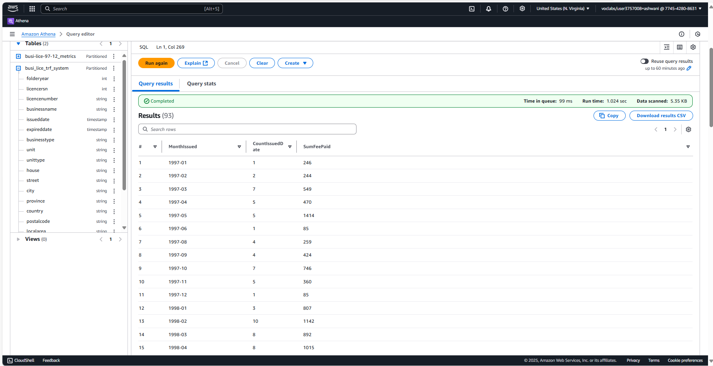
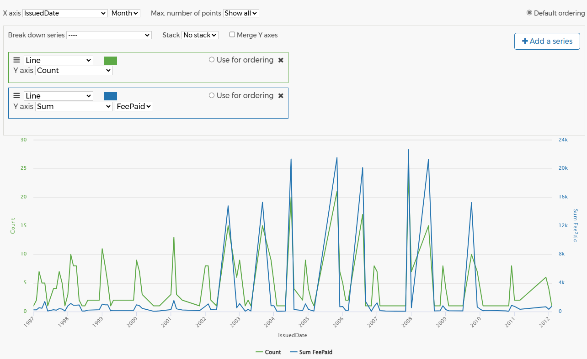

## Phase 5: Data Analysis

In this phase, we conducted detailed data analysis using AWS DataBrew and Amazon Athena to uncover meaningful trends and insights in Vancouver’s business licensing data. The analysis focused on identifying temporal licensing patterns, particularly the number of licenses issued and the associated fee payments over time.

---

### Data Preparation for Analysis

Following earlier phases of ingestion, profiling, cleaning, and cataloging, we prepared the cleaned dataset in both `.csv` and `.parquet` formats. These were stored in the `licence-trf-ash` S3 transfer bucket, organized into `user/` and `system/` directories. CSV format was chosen for user-level accessibility, while Parquet was used for efficient, column-based querying in Athena.

---

### SQL Query in Amazon Athena

Amazon Athena was used to execute an SQL query on the curated table `busi_lice_trf_system`. This query grouped records by issuance month (`MonthIssued`), calculated the number of issued licenses (`CountIssuedDate`), and summed the fees paid (`SumFeePaid`), enabling a structured trend analysis.

  
*Figure: SQL query in Athena used to aggregate license data by month.*

---

### Query Results

The results from the query were displayed in tabular form, showing consistent monthly licensing trends across multiple years. This output clearly showed peaks and troughs in both the number of licenses issued and fees paid, offering valuable insight into seasonal or economic patterns.

  
*Figure: Aggregated results by month displaying issued license counts and fees paid.*

---

### External Validation Using Vancouver City Data Portal

To ensure analytical robustness and accuracy, we compared our aggregated AWS-based results with the Vancouver City Data Portal. The external portal's monthly trends matched the patterns uncovered in our analysis, validating the SQL logic and overall data pipeline design.

  
*Figure: Monthly licensing trends from the Vancouver City Data Portal confirming analysis accuracy.*

---

### Key Outcomes

- **Structured Insight**: Aggregation by issuance month revealed cyclical patterns in licensing activities.
- **SQL-Based Flexibility**: Enabled efficient slicing and grouping of data from Parquet files.
- **Cross-Validation**: Comparison with open city data sources affirmed result accuracy and consistency.

---

### Tools Used
- **Amazon Athena** – For executing SQL queries on structured data.
- **AWS DataBrew** – For transformation, formatting, and exporting data for analysis.
- **Vancouver City Data Portal** – For benchmarking and result verification.

---

This phase played a crucial role in verifying that the curated datasets not only passed governance checks but were also reliable for real-world analytical use cases.
