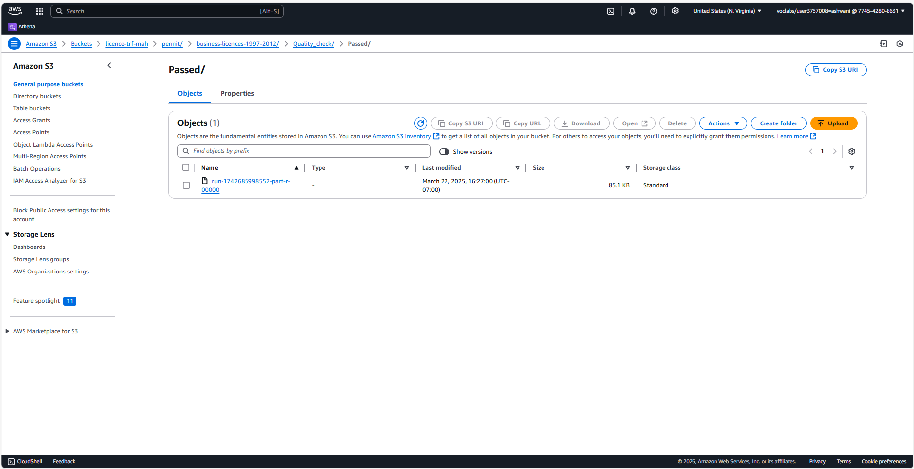

## Phase 5: Data Analysis

In this phase, we performed exploratory and structured data analysis using AWS DataBrew and Amazon Athena. The goal was to uncover trends in business licensing activity across Vancouver by aggregating the number of licenses issued and the corresponding fee payments over time.

### Overview

After successfully cleaning and transforming the business licensing dataset in earlier phases, we moved forward with structured analysis. The cleaned data was saved in both `.csv` and `.parquet` formats within separate folders (`user/` and `system/`) in the transfer bucket `licence-trf-ash`. The `.parquet` format was selected for its columnar storage advantages, enabling efficient querying in Amazon Athena.

---

### SQL Query in Amazon Athena

To identify licensing trends, a SQL query was executed in Amazon Athena on the curated table `busi_lice_trf_system`. This query grouped licenses by their issuance month (`MonthIssued`), calculated how many were issued (`CountIssuedDate`), and summed up the fees paid (`SumFeePaid`).

*Figure: The SQL query groups the data by month, aggregates the number of licenses issued, and sums up the fees paid.*

---

### Query Results

The query successfully returned monthly aggregated data with licensing activity. This data structure closely mirrored the structure published on the Vancouver City Data Portal, further validating the approach.

*Figure: Query results showing monthly licensing trends.*

---

### Validation Against Vancouver Open Data

The structure and values observed in the Athena results were compared with the Vancouver City Data Portal’s aggregated business license view. The comparison confirmed the validity of the SQL-based aggregation, affirming the analytical accuracy and data reliability.

This analytical approach ensures transparency, replicability, and strong alignment with published governmental data standards. It also provided confidence in the transformed data pipeline established across previous phases — from ingestion to cleaning, summarization, and cataloging.

---

### Tools Used
- **Amazon Athena**: For running SQL queries on curated Parquet data.
- **AWS DataBrew**: For data transformation and format standardization.
- **Vancouver City Data Portal**: For analytical validation.

---
