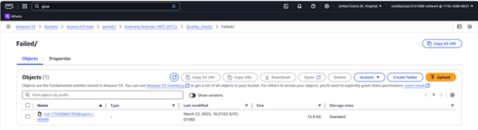

## Phase 6: Data Governance & Monitoring

This phase emphasizes two essential pillars of data infrastructure: **governance** and **monitoring**. Using AWS Glue, Amazon S3, AWS CloudTrail, and Amazon CloudWatch, we implemented a system for quality enforcement, auditability, and real-time observability across our business licensing dataset pipeline.

---

### Step 1: Data Quality Management with AWS Glue

We designed and deployed a robust Glue workflow to enforce data quality standards. The ETL workflow begins with data extraction from the `licence-cur-ash` curated bucket and includes data validation, transformation, and conditional routing based on predefined data quality rules.

  
*Figure: AWS Glue workflow for data quality checks and conditional data routing.*

This pipeline uses a **Data Quality Check** transformation node to automatically assess each record. If the data meets the criteria, it is routed into the `Passed` branch; otherwise, it is routed into `Failed`. Each branch performs additional transformations before loading the records into their respective S3 destinations.

---

### Step 2: Job Execution Confirmation

The successful run of the Glue ETL job (`busi-lice-97-12-QC-ash`) confirms that the workflow was executed as intended. The job utilized 10 DPUs and completed within 2 minutes, showing efficiency and optimal resource allocation.

  
*Figure: Job execution details, including runtime, capacity, and job success status.*

---

### Step 3: Output Routing Based on Quality Checks

Using the **Amazon S3 folder structure**, we stored quality-assessed datasets under clearly labeled directories:

- `Passed/` contains all records that met quality benchmarks and are ready for downstream processing.
- `Failed/` contains records that violated quality criteria and require review.

These folders are part of the path:  
`s3://licence-trf-mah/permit/business-licences-1997-2012/Quality_check/`

  
*Figure: Successfully validated data routed to the ‘Passed’ folder.*

  
*Figure: Records failing validation routed to the ‘Failed’ folder for correction.*

---

### Step 4: Infrastructure Monitoring with Amazon CloudWatch

To ensure visibility into resource utilization and bucket health, we configured a **custom CloudWatch dashboard** named `busi-lice-97-23-MCR-ash`. This dashboard includes widgets that track:

- **Bucket size (in bytes)**
- **Resource usage (CPU, memory, and I/O)**

  
*Figure: Real-time AWS CloudWatch dashboard tracking project-specific metrics.*

This dashboard provides timely alerts and continuous insight, helping maintain a high-availability data platform.

---

### Step 5: Activity Logging with AWS CloudTrail

AWS CloudTrail was configured with the trail name `busi-lice-97-12-tra-ash`. It continuously logs AWS API activity, providing traceability for:

- Job executions
- File uploads and downloads
- Data transformations
- Resource modifications

  
*Figure: AWS CloudTrail dashboard showing the audit trail configuration and active logging status.*

These logs serve as the backbone for **compliance audits, operational transparency**, and **incident response**, strengthening the platform's trust and security.

---

### Summary

| Area                 | Tool/Service         | Outcome |
|----------------------|----------------------|---------|
| Data Quality         | AWS Glue ETL         | Conditional routing, validation, and storage of valid/invalid records. |
| Job Monitoring       | Glue Job Metrics     | Verified efficient resource utilization. |
| Data Routing         | Amazon S3            | Organized output into `Passed/` and `Failed/` folders. |
| Infrastructure Monitoring | Amazon CloudWatch | Live metrics for bucket and resource usage. |
| Governance & Audit   | AWS CloudTrail       | Continuous activity logging for full traceability. |

---

Through this phase, we ensured that our AWS data pipeline was not only operationally sound but also **governed, auditable, and continuously monitored**, meeting the expectations of enterprise-grade data architecture.
